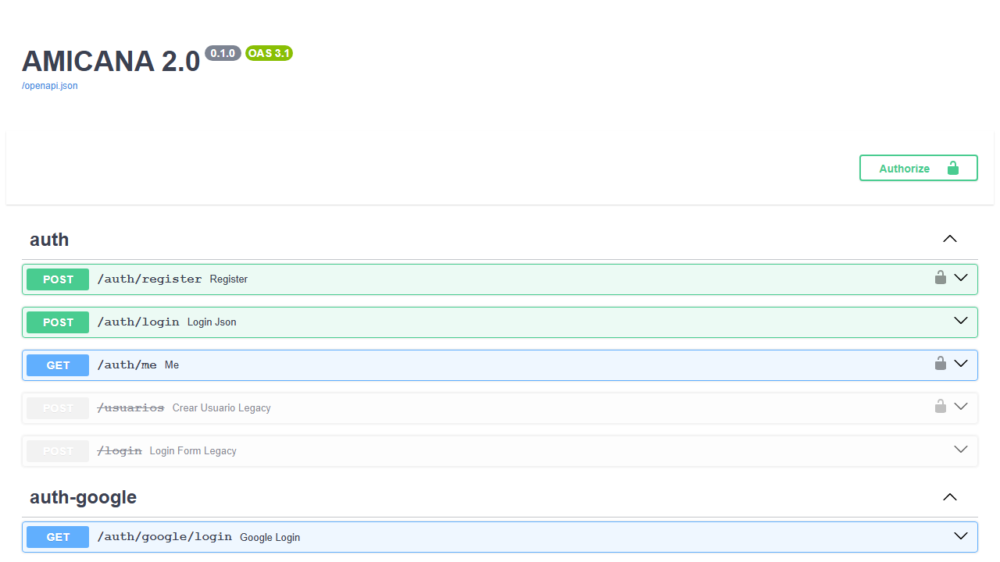

# Documentación técnica — AMICANA 2.0

Este documento describe la arquitectura, el stack, los módulos y las decisiones técnicas
del sistema. Complementa al [`README.md`](../README.md) (instalación rápida), a
[`APIS.md`](../APIS.md) (detalle de integraciones externas) y a
[`CHANGELOG.md`](../CHANGELOG.md) (historial de cambios por versión).

---

## Índice

- [Arquitectura general](#arquitectura-general)
- [Stack tecnológico](#stack-tecnológico)
- [Organización del proyecto](#organización-del-proyecto)
- [Módulos y componentes principales](#módulos-y-componentes-principales)
- [Modelo de datos](#modelo-de-datos)
- [Integración con APIs externas](#integración-con-apis-externas)
- [Seguridad y validaciones](#seguridad-y-validaciones)
- [Manejo de errores](#manejo-de-errores)
- [Instalación y ejecución local](#instalación-y-ejecución-local)
- [Decisiones técnicas relevantes](#decisiones-técnicas-relevantes)

---

## Arquitectura general

AMICANA 2.0 es una aplicación **monolítica modular**: un único backend FastAPI expone
toda la API REST, sirve el frontend estático (Vanilla JS) y actúa como proxy hacia un
workflow de **n8n** que implementa el chatbot.

```
┌─────────────┐       HTTP        ┌──────────────────────────────┐
│  Frontend    │ ─────────────────▶│  FastAPI (backend/app)        │
│ (Vanilla JS) │◀──────────────────│  routers / services / schemas │
│ /app/*.html  │                    │  /static  /app  /docs (Swagger)│
└─────────────┘                    └──────────────┬────────────────┘
                                                    │
                       ┌────────────────────────────┼──────────────────────┐
                       │                            │                      │
                ┌──────▼──────┐            ┌────────▼───────┐      ┌───────▼───────┐
                │  MySQL 8     │            │  MercadoPago    │      │ Google OAuth2 │
                │ gestion_     │            │  REST API       │      │ (login)       │
                │ facturas_    │            └─────────────────┘      └───────────────┘
                │ amicana      │
                └──────────────┘
                       ▲
                       │ POST /chatbot/session, /alumnos/buscar, etc.
                       │ (X-Chatbot-Key)
                ┌──────┴──────────┐        ┌──────────────────┐
                │  n8n workflow    │───────▶│  Groq LLM API     │
                │ amicana-chatbot  │        │ llama-3.3-70b     │
                └──────────────────┘        └──────────────────┘
```

**Flujo de una petición típica (web):**

1. El navegador carga `frontend/*.html` servido por FastAPI vía `StaticFiles` en `/app`.
2. El JS del frontend llama a la API (`/auth/login`, `/mis-cuotas`, `/perfil`, etc.) con
   `Authorization: Bearer <JWT>`.
3. El router correspondiente valida el token (`auth.get_current_user` /
   `require_role` / `require_any_role`), delega en un `service` si la lógica es
   compleja (pagos, PDF, auditoría, Google) y accede a MySQL vía
   `database.get_connection()`.
4. La respuesta siempre tiene la forma `{"ok": bool, ...}`.

**Flujo del chatbot (Ianna):**

1. El widget (`static/chatbot-widget.js`) hace `POST /chatbot` al backend (nunca llama
   a n8n directo, para evitar problemas de CORS).
2. El endpoint `/chatbot` en `main.py` aplica **rate limiting** por sesión
   (`CHATBOT_RATE_LIMIT` mensajes/hora) y reenvía el body a `N8N_WEBHOOK_URL`.
3. El workflow n8n consulta/actualiza la sesión vía
   `GET/POST /chatbot/session/{id}` (autenticado con header `X-Chatbot-Key`), resuelve
   el intent con el LLM (Groq) y, según el caso, llama a `/alumnos/buscar`,
   `/alumnos/{id}/cuotas`, `/pagar-cuota/{id}`, `/pagos/generar-factura-pdf` o
   `/pagos/confirmar-manual`.
4. n8n responde `{text, qr_url?, pdf_url?}`; FastAPI normaliza el formato
   (`_normalize_chatbot_response`) y lo devuelve al widget.

---

## Stack tecnológico

| Capa | Tecnología | Notas |
|------|-----------|-------|
| Lenguaje backend | Python 3.11 | |
| Framework API | FastAPI 0.135 + Uvicorn | Documentación interactiva en `/docs` (Swagger) |
| Validación de datos | Pydantic 2.x | Modelos en `backend/app/schemas/` |
| Base de datos | MySQL 8 (`gestion_facturas_amicana`) | Driver `mysql-connector-python` |
| Autenticación | JWT (HS256, `python-jose`) + `bcrypt` | + Google OAuth 2.0 |
| Pagos | Mercado Pago REST API (Checkout Pro) | Sandbox (`TEST-...`) o producción (`APP_USR-...`) |
| Generación de PDF | ReportLab | Recibos de pago |
| Generación de QR | `qrcode` + `Pillow` | QR de transferencia bancaria sin comisión |
| Chatbot / orquestación | n8n (self-hosted, Docker) | Workflow `n8n/amicana-chatbot.json` |
| LLM del chatbot | Groq API — `llama-3.3-70b-versatile` | Compatible OpenAI, intercambiable |
| Frontend | HTML + CSS + Vanilla JS | Sin framework, servido como estático por FastAPI |
| Testing backend | pytest | `backend/tests/`, BD mockeada |
| Testing E2E/UI/API | Playwright | `tests/`, 3 actividades (UI, API+mock, regresión) |
| Túnel de desarrollo | ngrok (dominio estático) | Requerido por Google OAuth y webhooks MP en local |
| Contenedores | Docker / docker-compose | n8n local; backend dockerizado para Railway |
| CI/CD | GitHub Actions | tests (pytest) + deploy (Railway CLI) en push a `main` |
| Hosting (producción) | Railway | Backend (Docker), MySQL (plugin), n8n (imagen `n8nio/n8n`) |

---

## Organización del proyecto

```
backend/
  app/
    main.py            FastAPI: lifespan (seed admin), CORS, routers, proxy /chatbot,
                        manejadores de excepciones globales, montaje de /app y /static
    auth.py            JWT (HS256), bcrypt, dependencias get_current_user / require_role
    database.py        get_connection() — conexión MySQL desde variables de entorno
    dependencies.py    Dependencias compartidas de inyección
    mercadopago_qr.py  Orquestador: crea preference MP + persiste en BD
    routers/           Un router por dominio (ver tabla de módulos)
    services/          Lógica de negocio reutilizable (Google, MP, PDF, auditoría)
    schemas/           Modelos Pydantic de entrada/salida por dominio
    utils/             responses.py (helper error()), validators.py
    models/            chat_session.py — repositorio de sesiones del chatbot
  tests/               Suite pytest (BD mockeada vía conftest.py)
  requirements.txt     Dependencias de producción
  requirements-dev.txt Dependencias de testing (pytest, etc.)
  .env.example         Plantilla de variables de entorno
database/
  BD_Amicana.sql       Schema canónico consolidado (15 tablas, idempotente)
  migrations/          Migraciones incrementales 001 → 012 (solo para upgrades)
frontend/
  index.html           Login / registro / Google OAuth
  admin.html           Panel administrativo (6 módulos)
  alumno.html          Portal del alumno
  estilos.css
static/
  chatbot-widget.js    Widget del chatbot Ianna (Vanilla JS)
n8n/
  amicana-chatbot.json Workflow del chatbot (importar en n8n)
tests/
  actividad-01-ui/     Tests de UI con mocking total (Playwright)
  actividad-02-api-mock/  Tests de API real + mocking + híbridos
  actividad-03-regresion/ Suite de regresión (28 tests, 8 funcionalidades críticas)
docs/
  documentacion_tecnica.md  (este archivo)
  etapa4/              Capturas de pantalla
  specs/               Specs históricas (no se versiona, ver .gitignore)
Dockerfile / railway.toml   Build y despliegue del backend en Railway
docker-compose.yml          n8n local
```

---

## Módulos y componentes principales

### Routers (`backend/app/routers/`)

| Router | Prefijo principal | Responsabilidad |
|--------|-------------------|------------------|
| `auth` | `/auth`, `/login`, `/usuarios` | Registro (con normalización de email y validación de password), login, emisión de JWT |
| `google_auth` | `/auth/google/*` | Login federado con Google OAuth 2.0 (CSRF state, exchange code, get-or-create usuario) |
| `alumnos` | `/alumnos` | CRUD de alumnos, búsqueda (usada por el chatbot), cuotas por alumno |
| `cursos` | `/cursos` | CRUD de cursos, filtros por modalidad/categoría |
| `pagos` | `/pagos/*`, `/pagar-cuota`, `/mis-cuotas`, etc. | Endpoints de pago (MP + legacy), generación de PDF, confirmación manual, webhook MP |
| `qr` | `/qr` | Generación de QR de transferencia bancaria |
| `perfil` | `/perfil` | GET/PUT de perfil propio, set de password local para usuarios Google |
| `avisos` | `/avisos` | Avisos institucionales visibles para alumnos |
| `calendario` | `/calendario` | Calendario académico (clases por curso) |
| `comunicados` | `/comunicados` | Comunicados internos (staff) |
| `eventos` | `/eventos` | Eventos institucionales (feriados, intercambios) |
| `reportes` | `/reportes` | Reportes de alumnos deudores, exportación a PDF |
| `configuracion` | `/configuracion` | Preferencias del sistema (clave/valor) editables desde el panel admin |
| `progreso` | `/progreso` | Progreso académico del alumno (niveles CEFR, notas por unidad) |
| `chatbot` | `/chatbot/session*` | CRUD de sesiones de chat, limpieza de sesiones viejas (admin) |
| `chatbot_data` | `/chatbot/welcome`, `/chatbot/faq` | Datos públicos para el widget (requiere `X-Chatbot-Key`) |

Además, `main.py` expone directamente:

- `GET /Prueba` — smoke check (`{"mensaje": "AMICANA 2.0 funcionando 🔥"}`).
- `POST /chatbot` — proxy hacia n8n con rate limiting y normalización de respuesta.
- `GET /_test_500` — endpoint de prueba para los handlers de error (solo si `ENV=test`).

### Services (`backend/app/services/`)

| Service | Usado por | Responsabilidad |
|---------|-----------|------------------|
| `auth_service.py` | `routers/auth.py` | Lógica de registro/login (hash de password, validaciones) |
| `google_service.py` | `routers/google_auth.py` | Flujo OAuth2 con Google (state CSRF, intercambio de código, alta/login de usuario) |
| `mercadopago_client.py` | `mercadopago_service.py` | Cliente HTTP puro contra la API de MP (sin BD) |
| `mercadopago_service.py` | `routers/pagos.py` | Wrapper de `mercadopago_qr` con registro de auditoría |
| `pdf_service.py` | `routers/pagos.py`, `routers/reportes.py` | Generación de PDFs (recibos, reportes) con ReportLab |
| `auditoria_service.py` | varios routers | `registrar_accion()` — historial de operaciones (módulo Auditoría, solo admin) |

### Utils (`backend/app/utils/`)

- `responses.py` — `error()`: helper para levantar `HTTPException` con cuerpo
  `{"ok": false, "mensaje": ...}` uniforme.
- `validators.py` — `validar_dni`, `validar_telefono_ar`, `validar_email_corporativo`
  (whitelist de dominios), `validar_password_fuerte`.

---

## Modelo de datos

Base de datos `gestion_facturas_amicana` (MySQL 8, `utf8mb4`), 15 tablas. Schema canónico
en [`database/BD_Amicana.sql`](../database/BD_Amicana.sql) (idempotente: `CREATE TABLE IF
NOT EXISTS` + `INSERT IGNORE`).

| Tabla | Propósito | Relaciones clave |
|-------|-----------|-------------------|
| `cursos` | Catálogo de cursos (nombre, monto de cuota, modalidad, categoría) | Referenciada por `usuarios`, `calendario_clases`, `comunicados`, `unidades` |
| `usuarios` | Cuentas (alumnos, administrativos, admin). Soporta auth local (bcrypt) y Google OAuth | FK → `cursos`; `google_id` único para cuentas federadas |
| `niveles` | Niveles CEFR (A1–C2), catálogo fijo | Referenciada por `progreso_alumno` |
| `progreso_alumno` | Progreso académico (nivel actual, módulos completados, próximo examen) | FK → `usuarios`, `niveles` (1:1 por alumno) |
| `cuotas` | Cuotas a pagar por alumno (monto, vencimiento, estado, comprobante) | FK → `usuarios`; estado `pendiente / vencida / pagada / pendiente_verificacion` |
| `pagos` | Pagos legacy / manuales (no MP) | FK → `usuarios` |
| `pagos_mp` | Transacciones de Mercado Pago (preference, payment_id, estado, external_reference) | Vinculada a `cuotas` vía `preference_id` / `external_reference` |
| `chat_sessions` | Sesiones persistidas del chatbot Ianna (historial JSON, estado, intentos de auth) | FK → `usuarios` (alumno identificado) |
| `avisos` | Avisos institucionales visibles para alumnos | FK → `usuarios` (autor) |
| `calendario_clases` | Clases programadas por curso (fecha, hora) | FK → `cursos`, `usuarios` (creador) |
| `comunicados` | Comunicados internos (no visibles a alumnos) | FK → `cursos`, `usuarios` |
| `eventos_institucionales` | Feriados, conmemorativos, intercambios | FK → `usuarios` (creador) |
| `unidades` | Catálogo de unidades por curso | FK → `cursos` |
| `notas_alumno` | Notas por alumno/unidad/sección (grammar, vocabulary, speaking, etc.), escala 0–10 | FK → `usuarios`, `unidades` |
| `preferencias_sistema` | Configuración clave/valor editable desde el panel admin (nombre del instituto, recargos, etc.) | Sin FK — tabla de configuración global |

**Datos semilla** (`INSERT IGNORE`): 6 niveles CEFR, 4 cursos por defecto, 8 preferencias
del sistema. El usuario `admin@amicana.com` se crea en el `lifespan` de `main.py` si no
existe (password = `ADMIN_SEED_PASSWORD`).

---

## Integración con APIs externas

Ver [`APIS.md`](../APIS.md) para el detalle completo de variables y flujos. Resumen:

### Mercado Pago (Checkout Pro)

- **Flujo:** `POST /pagar-cuota/{id}` crea una *preference* vía
  `services/mercadopago_client.py`, persiste el registro en `pagos_mp` y devuelve
  `init_point` (link de pago).
- **Webhook:** `POST /pagos/webhook` recibe notificaciones de MP y actualiza el estado
  de la cuota/pago.
- **Seguridad:** si `MP_WEBHOOK_SECRET` está configurado, se valida la firma
  HMAC-SHA256 del header `x-signature` (con `x-request-id` y `payment_id`) en
  `routers/pagos.py` antes de procesar el webhook. Si la variable está vacía, el
  webhook se acepta sin validar (modo permisivo, documentado para desarrollo).

### Google OAuth 2.0

- **Flujo:** `GET /auth/google/login` redirige a Google con un `state` CSRF →
  `GET /auth/google/callback` intercambia el código por tokens, obtiene el perfil y
  hace *get-or-create* del usuario (`auth_provider='google'`, `google_id` único) →
  emite JWT propio y redirige al frontend (`GOOGLE_POST_LOGIN_REDIRECT`).
- Un usuario Google puede además **setear una password local** desde `/perfil` —
  queda con `tiene_password_local=True` y puede loguearse también con email/password.

### n8n + Groq (Chatbot Ianna)

- El **widget** solo conoce `POST /chatbot` (FastAPI); nunca llama a n8n directo.
- **FastAPI → n8n:** `POST {N8N_WEBHOOK_URL}` con el mensaje del usuario; timeout
  configurable (`N8N_TIMEOUT_SECONDS`); la llamada se ejecuta en threadpool para no
  bloquear el event loop (n8n llama *de vuelta* a FastAPI durante su ejecución).
- **n8n → FastAPI:** autenticado con header `X-Chatbot-Key` (= `CHATBOT_INTERNAL_KEY`).
  Endpoints usados: `/chatbot/session/{id}` (GET/POST), `/alumnos/buscar`,
  `/alumnos/{id}/cuotas`, `/pagar-cuota/{id}`, `/pagos/generar-factura-pdf`,
  `/pagos/confirmar-manual`.
- **n8n → Groq:** nodo HTTP "Groq Router" → `https://api.groq.com/openai/v1/chat/completions`,
  modelo `llama-3.3-70b-versatile`, formato OpenAI (`messages[]`, `choices[0].message.content`).
  Header `Authorization: Bearer {{ $env.GROQ_API_KEY }}`. El LLM es intercambiable
  editando ese único nodo.
- **Rate limiting:** `main.py` limita `CHATBOT_RATE_LIMIT` mensajes por sesión por
  hora (default 30) antes de reenviar a n8n (HTTP 429 si se excede).

---

## Seguridad y validaciones

| Mecanismo | Implementación | Dónde |
|-----------|-----------------|-------|
| Autenticación | JWT firmado HS256 (`python-jose`), expiración 60 min | `auth.py` (`create_access_token`, `get_current_user`) |
| Hash de password | `bcrypt` | `auth.py` (`hash_password` / `verify_password`) |
| Control de acceso por rol | `require_role("admin")`, `require_any_role(...)` | Dependencias FastAPI en cada router |
| Roles del sistema | `admin` (acceso total), `administrativo` (sin auditoría), `alumno` (propios datos) | Tabla `usuarios.rol` |
| Autenticación interna (n8n ↔ backend) | Header `X-Chatbot-Key` == `CHATBOT_INTERNAL_KEY`, o JWT si el usuario ya está logueado (`get_chatbot_or_current_user`) | `auth.py` |
| Normalización de email | `lower()` al registrar y al buscar | `routers/auth.py`, `services/auth_service.py` |
| Whitelist de dominios de email | `EMAIL_DOMAIN_WHITELIST` (CSV, opcional) | `utils/validators.py::validar_email_corporativo` |
| Fuerza de password | ≥ 8 caracteres, ≥1 letra y ≥1 número | `utils/validators.py::validar_password_fuerte` |
| Validación de DNI / teléfono AR | Regex (`7-8` dígitos / `8-15` con `+`, espacios, guiones) | `utils/validators.py` |
| CORS | Orígenes permitidos vía `CORS_ORIGINS` (CSV); default restringido a localhost en dev | `main.py` |
| Webhooks MP | Validación HMAC-SHA256 de `x-signature` si `MP_WEBHOOK_SECRET` está definido | `routers/pagos.py` |
| Rate limiting del chatbot | `CHATBOT_RATE_LIMIT` mensajes/sesión/hora | `main.py` |
| Secret de JWT | `SECRET_KEY` obligatoria por variable de entorno — la app no arranca sin ella | `auth.py` |
| Auditoría | `registrar_accion()` registra operaciones sensibles (alta/baja/modificación) | `services/auditoria_service.py`, panel "Auditoría" (solo admin) |
| Validación de entrada | Modelos Pydantic por endpoint (`schemas/`) | FastAPI valida automáticamente, errores → 422 uniforme |

---

## Manejo de errores

`main.py` registra tres *exception handlers* globales para que **toda** respuesta de
error tenga la forma `{"ok": false, "mensaje": ..., "errores"?: [...]}`:

| Excepción | Status | Respuesta |
|-----------|--------|-----------|
| `RequestValidationError` (Pydantic/FastAPI) | 422 | `{"ok": false, "mensaje": "Datos inválidos", "errores": [{"campo", "detalle"}, ...]}` |
| `HTTPException` (incluye `error()` de `utils/responses.py`) | el que indique el endpoint | `{"ok": false, "mensaje": "..."}` |
| `Exception` genérica no capturada | 500 | `{"ok": false, "mensaje": "Error interno del servidor"}` (traza completa en logs vía `logger.exception`) |

El endpoint `GET /_test_500` (solo activo con `ENV=test`) existe para que los tests
verifiquen el handler de 500 sin depender de un bug real.

---

## Instalación y ejecución local

Pasos detallados en [`README.md`](../README.md#instalación-desde-cero). Resumen:

1. `mysql -u root -p < database/BD_Amicana.sql` (crea `gestion_facturas_amicana` con
   las 15 tablas y los seeds).
2. `cp backend/.env.example backend/.env` y completar `SECRET_KEY`, credenciales MySQL
   y, opcionalmente, MercadoPago / Google / Groq.
3. `cd backend && python -m venv venv && venv\Scripts\activate && pip install -r requirements.txt`
4. `uvicorn app.main:app --reload` → backend en `http://localhost:8000`, frontend en
   `http://localhost:8000/app`, Swagger en `http://localhost:8000/docs`.
5. (Opcional) `ngrok http --domain=<tu-dominio> 8000` para Google OAuth / webhooks MP.
6. (Opcional) `docker compose up -d` levanta n8n en `http://localhost:5678` para el
   chatbot; importar `n8n/amicana-chatbot.json`.

**Tests:**

```bash
cd backend
pip install -r requirements-dev.txt
pytest tests/ -v          # unitarios, BD mockeada

cd ..
npm install && npx playwright install chromium
npx playwright test       # E2E/UI/API (requiere backend + MySQL corriendo)
```

---

## Decisiones técnicas relevantes

- **Arquitectura routers / services / schemas / utils**: separa el ruteo HTTP de la
  lógica de negocio y de los modelos de datos, permitiendo testear servicios sin
  levantar FastAPI. Adoptada durante la Etapa 3 (reorganización completa, ver
  `CHANGELOG.md` v2.3).

- **`pagos` (legacy) vs `pagos_mp`**: se mantienen separadas porque preceden distintas
  etapas del proyecto — `pagos` cubre pagos manuales/QR bancario sin comisión,
  `pagos_mp` cubre el ciclo completo de Mercado Pago (preference → webhook → estado).
  Unificarlas habría requerido una migración de datos no justificada por el alcance.

- **Schema SQL consolidado e idempotente** (`BD_Amicana.sql`): en vez de exigir correr
  12 migraciones en orden para una instalación nueva, se consolidó todo en un único
  archivo con `CREATE TABLE IF NOT EXISTS` / `INSERT IGNORE`. Las migraciones
  incrementales se conservan solo para *upgrades* de instalaciones existentes.

- **LLM del chatbot: Groq en vez de Gemini** (`llama-3.3-70b-versatile`): el free tier
  de Gemini quedó con `limit: 0` por región y habilitar billing requería un pago no
  disponible. Groq ofrece un tier gratuito sin tarjeta y es compatible con la API de
  OpenAI, lo que simplificó el nodo HTTP del workflow.

- **Proxy `/chatbot` en FastAPI en vez de exponer n8n directo al navegador**: evita
  configurar CORS en n8n y centraliza el rate limiting y el logging de errores en el
  backend. La llamada a n8n se ejecuta en *threadpool* porque el propio workflow llama
  de vuelta a FastAPI (si se hiciera de forma síncrona en la ruta `async`, se bloquea
  el event loop y se genera un deadlock).

- **Autenticación interna n8n↔backend con clave compartida (`CHATBOT_INTERNAL_KEY`)**
  en vez de JWT: simplifica la configuración (una sola variable en ambos servicios) y
  es suficiente porque n8n corre en un servicio privado del mismo proyecto.

- **Despliegue en Railway con Docker** (`Dockerfile` + `railway.toml`,
  `builder = "DOCKERFILE"`): se eligió un build basado en `Dockerfile` (en vez de
  Nixpacks) para tener control explícito sobre la imagen base de Python y las
  dependencias del sistema (usadas por `Pillow`/`reportlab`). El archivo
  `nixpacks.toml` que existía de una etapa anterior se eliminó por quedar sin uso.

- **n8n como servicio Docker separado dentro del mismo proyecto Railway**, con volumen
  persistente en `/home/node/.n8n`: sin volumen, cada redeploy borraría el workflow
  importado y las credenciales configuradas en n8n.

- **Variables de entorno como única fuente de configuración** (incluyendo URLs entre
  servicios — `FASTAPI_BASE_URL`, `N8N_WEBHOOK_URL`, `CORS_ORIGINS`, `NGROK_URL`):
  permite mover el proyecto entre entornos (local → ngrok → Railway) sin tocar código,
  solo redefiniendo variables.

---

## Anexo — Documentación interactiva de la API

FastAPI genera automáticamente documentación Swagger/OpenAPI en `/docs` (y `/redoc`)
con todos los endpoints, schemas Pydantic y la posibilidad de probar requests
autenticados desde el navegador:


